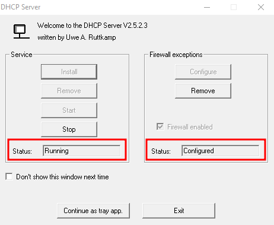

# Installation Process

Please, read the whole installation process carefully. It is not entirely a copy-and-paste installation guide :exclamation: 

## 1. Enable Hyper-V feature

To enable Hyper-V with some extra features, execute the following commands.

```powershell
Enable-WindowsOptionalFeature -Online -FeatureName Microsoft-Hyper-V-All
Enable-WindowsOptionalFeature -Online -FeatureName HypervisorPlatform
Enable-WindowsOptionalFeature -Online -FeatureName VirtualMachinePlatform
```

## 2. Install & Configure WSL

### Windows Subsystem for Linux (WSL)

Configure the WSL to version 1, so it uses the bridge Internace, instead of NAT in v2. For doing so, execute the following command on Powershell as Administrator.

```powershell
wsl --set-default 1
```

Then, install the Ubuntu WSL.

```powershell
wsl --install -d ubuntu
```

### Ansible

Then, once you have set up your Ubuntu machine and created a user, execute the following commands as a user to install Ansible.

```bash
sudo apt update
sudo apt install python3-pip -y
echo 'PATH=~/.local/bin:$PATH' >> ~/.bashrc
source ~/.bashrc
pip install --user ansible==7.3.0
pip install pywinrm==0.4.3 --user
```

Plus, you must create the file `/etc/wsl.conf` with the following content, so ansible can connect to the Linux machine through SSH.

```bash
# Enable extra metadata options by default
[automount]
enabled = true
root = /mnt/
options = "metadata,umask=77,fmask=11"
mountFsTab = false
```

Then, execute the command `Restart-Service LxssManager` within an elevated PowerShell.

### Vagrant

To install Vagrant, you need to execute the following commands:

```bash
echo 'export VAGRANT_WSL_ENABLE_WINDOWS_ACCESS="1"' >> ~/.bashrc
echo 'export VAGRANT_DEFAULT_PROVIDER=hyperv' >> ~/.bashrc
source ~/.bashrc
wget -O- https://apt.releases.hashicorp.com/gpg | gpg --dearmor | sudo tee /usr/share/keyrings/hashicorp-archive-keyring.gpg
echo "deb [signed-by=/usr/share/keyrings/hashicorp-archive-keyring.gpg] https://apt.releases.hashicorp.com $(lsb_release -cs) main" | sudo tee /etc/apt/sources.list.d/hashicorp.list
sudo apt update && sudo apt install vagrant -y
```

> A few vagrant plugins are required to launch and provision all of the VMs.  If you below vagrant plugin install commands fail, open up an administrative PowerShell prompt and run the command `Restart-Service LxssManager`.

```bash
vagrant plugin install winrm
vagrant plugin install winrm-fs
vagrant plugin install winrm-elevated
```

## 3. Setting up the AD environment 

Because Hyper-V doesn't provide tools to create internal networks as can be done with VirtualBox or VMWare. Hence, you need to create a virtual Switch and set an IP address to the new network adapter.

Execute the following command on PowerShell as Administrator.

```powershell
New-VMSwitch -SwitchName "NATSwitch" -SwitchType Internal

New-NetIPAddress -IPAddress 10.10.10.1 -PrefixLength 24 -InterfaceAlias "vEthernet (NATSwitch)" 

New-NetNAT -Name "NATNetwork" -InternalIPInterfaceAddressPrefix 10.10.10.0/24
```

Then, you will need to set up a DHCP server, so the machines can obtain an IP on the same network you created earlier. This only will be necessary for the installation process, then you can uninstall the DHCP server.

> :information_source: If you tried setting a static IP with Vagrant, at the moment of the writing of this document, Vagrant and Hyper-V do not get on well with network stuff. Hyper-V ignores almost any network configuration you add to a vagrant file.

The DHCP server I used for setting up the lab is from www.dhcpserver.de, a very intuitive and easy to set up. Follow the installation process as appears on this [link](https://www.dhcpserver.de/cms/running_the_server/).

> :information_source: Download it on `C:\widhcp` and do not forget to configure the firewall exceptions.

Once you have completed the process executing `dhcpwiz.exe` , replace the content of the file `dhcpsrv.ini` with the following content.

```bash
[SETTINGS]
IPPOOL_1=10.10.10.1-254
IPBIND_1=10.10.10.1
AssociateBindsToPools=1
Trace=1
DeleteOnRelease=0
ExpiredLeaseTimeout=3600

[GENERAL]
LEASETIME=86400
NODETYPE=8
SUBNETMASK=255.255.255.0
NEXTSERVER=10.10.10.1
DNS_0=1.1.1.1
ROUTER_0=10.10.10.1

[DNS-SETTINGS]
EnableDNS=0
FORWARD=1.1.1.1

[TFTP-SETTINGS]
EnableTFTP=0
ROOT=C:\widhcp\wwwroot
WritePermission=0

[HTTP-SETTINGS]
EnableHTTP=1
ROOT=C:\widhcp\wwwroot
```

Now, install and start the DHCP server executing the file `dhcpsrv.exe`  as Administrator.

> :warning: Once completed the installation process, I recommend you stop and remove the DHCP server because it can mess with the interface NATSwitch leading to odd behaviors.



Then, download the repository on `C:\`, so it can be accessed pretty easily through Ubuntu WSL

Finally, once the server is running, open your Ubuntu WSL  as an Administrator, and execute the following command and wait for it to finish. After that, you can stop and remove the DHCP server.

> :information_source: There is no need to install all the virtual machines, but if you want to use the AD environment, at least you must install "kms" and "goku, reboot the machines, and then install the other AD machine you want to use.

```bash
cd /mnt/c/capsulecorp-ad-pentest-hyperv/
vagrant up kms development kali goku krillin raditz gohan tien --provision
```

# Uninstall

In case you are tired of this lab environment or you are having problems with VirtualBox, you can get rid of everything with the following commands.

1. On your Ubuntu WSL, executed as Administrator. 

```bash
vagrant destroy kms development kali goku krillin raditz gohan tien -f
rm -rf /mnt/c/capsulecorp-pentest-hyperv/
 vagrant box list | cut -d ' ' -f 1 | xargs -I {} bash -c "vagrant box remove -f {}"
```

2. On PowerShell as Administrator

```powershell
Remove-VMSwitch -SwitchName "NATSwitch" -Force
Remove-NetNat -Confirm:$false -Name "NATNetwork"
```

3. Disable Hyper-V startup through a PowerShell as Administrator.

> If you want to enable it again, change `off` to `auto`.
```powershell
# To Turn it off
bcdedit /set hypervisorlaunchtype off

# To uninstall it completely
Disable-WindowsOptionalFeature -Online -FeatureName Microsoft-Hyper-V-All
Disable-WindowsOptionalFeature -Online -FeatureName HypervisorPlatform
Disable-WindowsOptionalFeature -Online -FeatureName VirtualMachinePlatform
```


